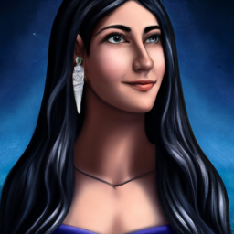

# The Abandoned Lighthouse of Hammersend

The adventurers arrive at the coastal town of Hammersend, where rumors of an abandoned lighthouse haunted by sea witches have spread. The townsfolk speak of strange occurrences and missing fishermen, urging the heroes to investigate the lighthouse and uncover its dark secrets.

## Plot Twist
Upon defeating the cult and stopping the ritual, the players discover a hidden tome that reveals the true nature of the sea witches and their connection to the town of Hammersend. The tome contains a prophecy that hints at a greater threat looming over the region, suggesting that the sea witches are merely pawns in a larger game.

## Rooms
### Room 1: Entrance and Guardian

**Objective**: Create an initial challenge.

**Design**: As the adventurers approach the abandoned lighthouse, they find the entrance blocked by a massive, rusted portcullis. Guarding the entrance are two acolytes of the sea witches, chanting incantations to summon dark energies. The players must either defeat the acolytes in combat or find a way to disable the portcullis using a skill check (e.g., a DC 15 Dexterity check with thieves' tools or a DC 14 Strength check to lift it). If they succeed, the portcullis creaks open, revealing the dark interior of the lighthouse.

**Description**: The entrance is foreboding, with the sound of the sea crashing against the rocks echoing in the background. The air is thick with tension as the players prepare to face the guardians of the lighthouse.

### Room 2: Puzzle or Roleplaying Challenge

**Objective**: Engage players with non-combat interaction.

**Design**: Inside the lighthouse, the players enter a circular chamber filled with strange, glowing runes on the walls. In the center, a pedestal holds a conch shell. To proceed, the players must solve a riddle inscribed on the wall: 'I am not alive, but I can grow; I don’t have lungs, but I need air; I don’t have a mouth, but water kills me. What am I?' (Answer: Fire). If they answer correctly, the runes illuminate, revealing a hidden passage. If they fail, a magical surge causes the room to fill with water, requiring a DC 13 Constitution saving throw to avoid taking damage.

**Description**: The chamber is illuminated by the soft glow of the runes, casting eerie shadows on the walls. The conch shell sits invitingly on the pedestal, but the riddle looms large in the air.

### Room 3: Trick or Setback

**Objective**: Introduce a complication or twist.

**Design**: As the players navigate the hidden passage, they encounter a room filled with illusions of their greatest fears, conjured by the cult's magic. Each player must make a DC 14 Wisdom saving throw. On a failure, they are frightened and must flee to the nearest exit, potentially leading them into a trap or back to the entrance. Additionally, the illusions can cause confusion, making it difficult to discern the real threats in the next room.

**Description**: The air is thick with dread as the players face their fears. Shadows dance around them, and whispers echo in their minds, creating an atmosphere of paranoia.

### Room 4: Climax, Big Battle, or Conflict

**Objective**: Present the main confrontation.

**Design**: The players enter the cult's main chamber, where they find their corrupted brother leading a ritual to summon a tentacle monster from the depths. The room is filled with acolytes and clerics, chanting and preparing for the summoning. The players must fight their way through the cultists while trying to stop the ritual. The corrupted brother, now a cleric of the sea witches, serves as the main antagonist, wielding powerful spells. The players must defeat him and the cultists before the monster is fully summoned, creating a tense and dynamic battle.

**Description**: The chamber is alive with dark energy, the air crackling with magic as the cultists chant. The sight of the corrupted brother at the center of the ritual sends a chill down the players' spines.

### Room 5: Reward, Revelation, Plot Twist

**Objective**: Resolve the dungeon with a satisfying conclusion.

**Design**: Upon defeating the cult and stopping the ritual, the players discover a hidden tome that reveals the true nature of the sea witches and their connection to the town of Hammersend. The tome contains a prophecy that hints at a greater threat looming over the region, suggesting that the sea witches are merely pawns in a larger game. Additionally, the players find a magical artifact (e.g., a trident of water control) that can aid them in future encounters. As they leave the lighthouse, they hear whispers of the sea witches vowing revenge, setting the stage for the next adventure.

**Description**: The atmosphere shifts from tension to relief as the players uncover the tome. However, the whispers of revenge linger in the air, hinting at future challenges.

## NPCs
### Seraphine the Cult Leader

**Appearance**: A tall, imposing woman with long, flowing black hair adorned with seashells, wearing a flowing robe that shimmers like the ocean waves. Her eyes are a deep blue, almost hypnotic, and her skin has a faint, iridescent sheen.

**Personality**: Charismatic and manipulative, Seraphine exudes an aura of authority and confidence. She is fiercely devoted to the sea witches and will stop at nothing to protect her cult, often using her charm to sway others to her cause.

**Role**: As the leader of the cult, Seraphine is the final confrontation for the players, wielding powerful magic granted by the sea witches.

### Corwin the Corrupted

**Appearance**: A once-handsome man now twisted by dark magic, with pale skin, sunken eyes, and a tattered robe that clings to his emaciated frame. His fingers are elongated and claw-like, and he carries a staff topped with a glowing sea crystal.

**Personality**: Tormented and conflicted, Corwin struggles between his lingering humanity and the dark influence of the sea witches. He is prone to fits of rage but can show moments of clarity and remorse.

**Role**: Corwin serves as a mini-boss within the dungeon, acting as a guardian to the cult's inner sanctum.

### Acolyte Mira

**Appearance**: A young woman with wild, tangled hair and a seaweed necklace, dressed in a simple robe stained with saltwater and dirt. Her eyes are wide with fanaticism, and she carries a dagger that glints ominously.

**Personality**: Eager and zealous, Mira is deeply devoted to the cult and believes wholeheartedly in the sea witches' power.

**Role**: As a low-ranking member of the cult, Mira serves as a minor antagonist who can either hinder the players with traps or provide them with information if they engage her in conversation.

## Loot Table
Loot table for the Abandoned Lighthouse of Hammersend.

| Roll | Item | Basic Description | Intermediate Description | Advanced Description |
|------|------|-------------------|-------------------------|----------------------|
| 1 | Sea Glass Trinket | A small piece of smooth sea glass | A necklace made of several pieces of sea glass | A beautifully crafted pendant with magical properties |
| 2 | Fisherman's Net | A frayed and worn fishing net | A sturdy net with catches still tangled in it | A magically enhanced net that can ensnare creatures |
| 3 | Coral Dagger | A simple dagger with a coral handle | A well-balanced dagger with coral inlays | A magical dagger that deals extra damage to aquatic foes |
| 4 | Potion of Water Breathing | A basic potion for short underwater breathing | A potion that lasts for an hour | A potion that grants the ability to breathe underwater indefinitely |
| 5 | Shell of Echoes | A small conch shell that makes faint sounds | A larger shell that can amplify sounds | A magical shell that can cast a spell of communication |
| 6 | Lantern of the Deep | A simple oil lantern that flickers | A well-made lantern that burns brightly | A magical lantern that reveals hidden paths in the dark |
| 7 | Sea Witch's Grimoire | A tattered book of spells with faded ink | A well-preserved book with several spells | A powerful grimoire containing rare and forbidden spells |
| 8 | Driftwood Staff | A plain staff made from driftwood | A staff with intricate carvings and a smooth finish | A magical staff that can control water and waves |
| 9 | Tidal Wave Amulet | A simple amulet with a wave design | An amulet that grants resistance to cold damage | A powerful amulet that can summon a tidal wave once per day |
| 10 | Mermaid's Tear | A single tear-shaped gem with a faint glow | A small pouch containing several mermaid tears | A legendary gem that can grant wishes related to the sea |
| 11 | Salted Fish | A small, preserved fish | A larger, well-seasoned fish | A rare fish that can be used in powerful potions |
| 12 | Fisherman's Boots | A pair of old, worn boots | Sturdy boots that provide good grip on wet surfaces | Magical boots that allow for swift movement on water |
| 13 | Cursed Compass | A broken compass that spins wildly | A functional compass that points to the nearest shore | A magical compass that leads to hidden treasures |
| 14 | Seaweed Wraps | A bundle of dried seaweed | A set of wraps that provide minor protection | Magical wraps that grant resistance to poison |
| 15 | Kraken Ink | A vial of black ink from a kraken | A larger vial that can be used for powerful spells | A legendary ink that can create illusions |
| 16 | Nautical Map | A simple map of the local waters | A detailed map with notes on sea routes | A magical map that reveals hidden underwater locations |
| 17 | Shell Armor | A set of armor made from large shells | A reinforced shell armor that provides decent protection | A magical shell armor that grants the wearer aquatic abilities |
| 18 | Siren's Song Flute | A simple wooden flute that plays a soft tune | A beautifully crafted flute that can charm creatures | A magical flute that can cast powerful enchantments |
| 19 | Leviathan Scale | A single scale from a large sea creature | A collection of scales that can be used for crafting | A legendary scale that grants the wearer immense power |
| 20 | Heart of the Sea Witch | A dark, pulsating gem that radiates power | A powerful artifact that can control water | The heart of the sea witch, granting immense magical abilities |
