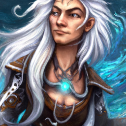

# The Abandoned Lighthouse of Hammersend

In the town of Hammersend, the peaceful facade hides a dark threat as a powerful cult worshipping ancient sea witches has taken control. The adventurers must infiltrate the cult's lair, an abandoned lighthouse, to rescue a corrupted brother and prevent the cult from summoning a devastating tentacle monster.

## Plot Twist
Upon victory, the players discover a hidden tome revealing the cult's larger plans to summon multiple sea monsters. The freed brother shares visions of a greater conspiracy involving other towns.

## Rooms
### Room 1: Entrance and Guardian

**Objective**: Defeat the acolytes or sneak past them using Dexterity (Stealth) checks against Wisdom (Perception).

**Design**: The entrance looms before you, a heavy door adorned with strange symbols that pulse faintly.

**Description**: As you approach the crumbling structure of the abandoned lighthouse, the salty breeze carries with it a sense of foreboding. Inside, two acolytes perform a ritual to strengthen their dark connection, guarding the entrance. You can choose to confront them or attempt to sneak by.

### Room 2: Puzzle or Roleplaying Challenge

**Objective**: Solve the riddle to obtain the conch shell.

**Design**: A large chamber with glowing runes illuminating a circular pedestal that holds a conch shell.

**Description**: Upon entering a large chamber, glowing runes illuminate a circular pedestal that holds a conch shell. A riddle inscribed on the wall reads, 'I am not alive, but I can grow; I don’t have lungs, but I need air; I don’t have a mouth, but water kills me.' Solve the riddle (Answer: Fire) to unlock the shell without triggering a backlash that causes 1d6 psychic damage.

### Room 3: Trick or Setback

**Objective**: Identify and defeat the false duplicates. Discover a hidden compartment with a healing potion after defeating them.

**Design**: A dimly lit room lined with mirrors reflecting distorted images.

**Description**: As the party continues, a dimly lit room lined with mirrors reflects distorted images of themselves. The mirrors are enchanted, creating illusory duplicates that attack the party. The duplicates mimic the players' abilities but have only 1 hit point, adding a layer of strategy to the combat.

### Room 4: Climax, Big Battle, or Conflict

**Objective**: Decide whether to free the brother or focus on defeating the cultists.

**Design**: The final chamber reveals a large summoning circle surrounded by chanting cultists.

**Description**: The final chamber reveals a large summoning circle surrounded by chanting cultists. The player's brother is bound to an altar, while the high cleric prepares to summon the tentacle monster. The players must fight acolytes and the high cleric, who employs spells like Hold Person and Spirit Guardians.

### Room 5: Reward, Revelation, Plot Twist

**Objective**: Gain loot, learn about the cult's plans, and establish future hooks for the campaign.

**Design**: A hidden area where the players discover a tome and magical trinkets.

**Description**: Upon victory, the players discover a hidden tome revealing the cult's larger plans to summon multiple sea monsters. The freed brother shares visions of a greater conspiracy involving other towns. Players receive magical trinkets and a map leading to the next cult location, setting the stage for a follow-up adventure.

## NPCs
### Captain Elara Stormwatch

**Appearance**: A tall, imposing figure with long, flowing hair that seems to ripple like the ocean waves. She wears dark robes adorned with sea motifs and wields a trident crackling with arcane energy.

**Personality**: Charismatic yet ruthless, she commands respect and fear among her followers. Elara is cunning and manipulative, always seeking to expand her power.

**Role**: Cult leader

### Finn the Lost

**Appearance**: A disheveled young man with haunted eyes and a gaunt face, wearing tattered clothing that once belonged to a sailor. His demeanor is conflicted, reflecting his internal struggle.

**Personality**: Torn between loyalty to the cult and his past self, Finn is filled with regret and confusion. He seeks redemption but feels trapped by his choices.

**Role**: Corrupted brother

### Talia the Acolyte

**Appearance**: A young woman with a fervent expression, dressed in simple robes that mark her as a cultist. Her hair is tied back, and she carries a small dagger for rituals.

**Personality**: Devout and eager to prove herself, Talia is zealous in her beliefs and willing to do whatever it takes to gain favor with her superiors.

**Role**: Devout cult member

## Loot Table
Loot table for the Abandoned Lighthouse of Hammersend.

| Roll | Item | Basic Description | Intermediate Description | Advanced Description |
|------|------|-------------------|-------------------------|----------------------|
| 1 | Sea Witch's Talisman | A simple seashell pendant with no magical properties. | A carved talisman that grants +1 to saving throws against water-based spells. | A powerful talisman that allows the wearer to breathe underwater for 1 hour once per day. |
| 2 | Lantern of the Deep | A basic oil lantern that flickers in the wind. | A sturdy lantern that illuminates a 30-foot radius and reveals hidden paths. | A magical lantern that casts daylight and reveals invisible creatures within its light. |
| 3 | Coral Dagger | A dull dagger made from coral, easily breakable. | A well-crafted dagger that deals an extra 1d4 damage to aquatic creatures. | A magical dagger that returns to the wielder's hand after being thrown and deals an extra 1d6 damage to aquatic creatures. |
| 4 | Acolyte's Robes | Tattered robes with no special features. | Robes that provide +1 to AC and resistance to cold damage. | Enchanted robes that grant advantage on Charisma checks when interacting with sea creatures. |
| 5 | Potion of Tidal Strength | A basic potion that tastes like saltwater. | A potion that grants +2 to Strength for 1 hour. | A potion that grants the effects of the spell 'Enlarge' for 1 hour. |
| 6 | Seafoam Cloak | A simple cloak that smells of the ocean. | A cloak that provides resistance to cold damage and advantage on stealth checks in water. | A magical cloak that allows the wearer to teleport up to 60 feet to a body of water once per day. |
| 7 | Trident of the Depths | A rusty trident with no magical properties. | A trident that deals an extra 1d6 damage to creatures in water. | A magical trident that can summon a wave to knock back enemies once per day. |
| 8 | Shell of Echoes | A plain conch shell that produces no sound. | A shell that can be blown to create a sound that distracts enemies (DC 12 Wisdom save). | A magical shell that can cast 'Thunderwave' once per day. |
| 9 | Cultist's Grimoire | A worn book with illegible text. | A grimoire containing basic spells related to water and sea creatures. | A powerful tome that grants the ability to cast 'Control Water' once per day. |
| 10 | Kraken Ink | A vial of black ink with no special properties. | A vial of ink that can be used to create magical scrolls. | A magical ink that allows the user to write spells that can be cast as rituals. |
